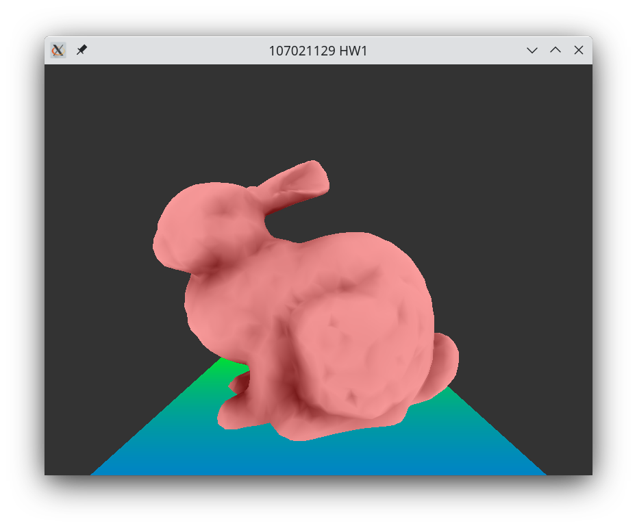
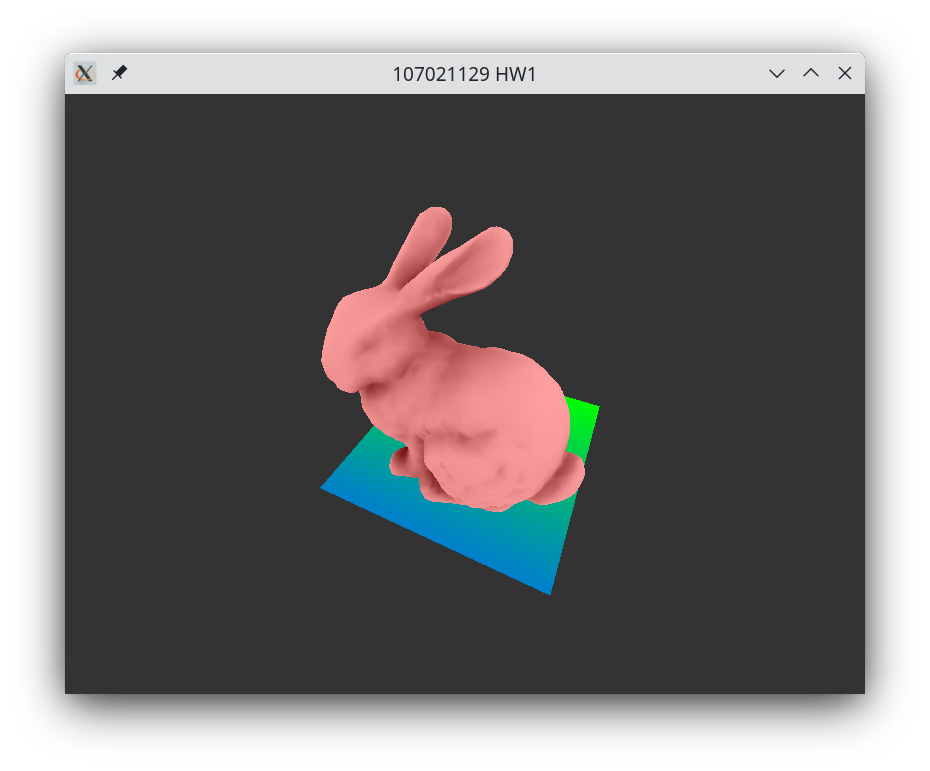
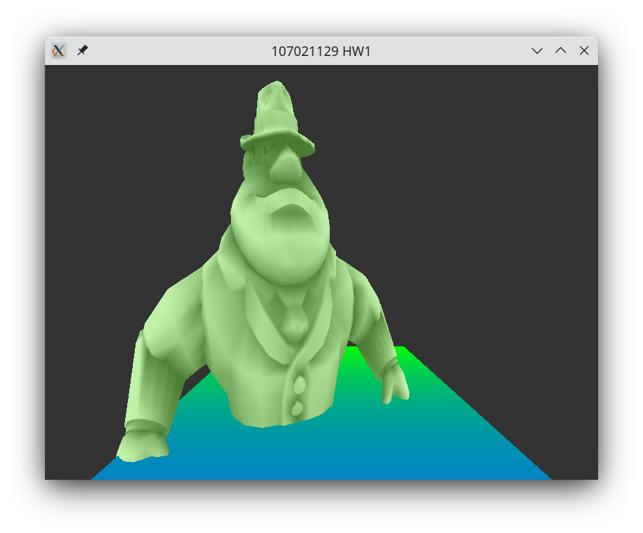
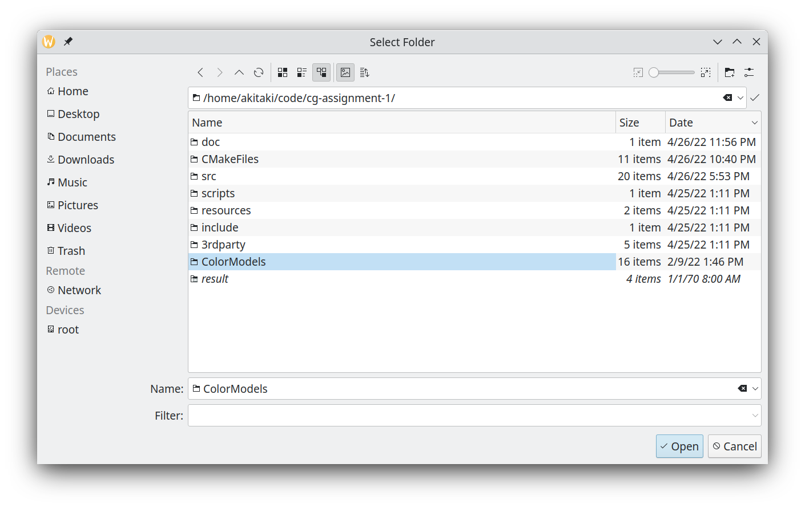
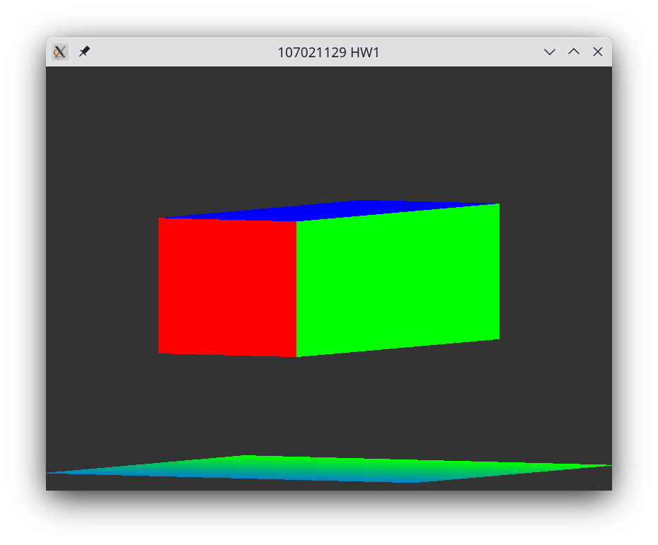

<!-- vim: set ft=markdown.pandoc colorcolumn=100: -->

# Dependencies

- C++17-compliant compiler
- CMake
- pkg-config, D-Bus, Xorg (Linux only)


# Build instructions

This project is tested on GitHub Actions to ensure that they build successfully on all major platforms.
Below subsections list out build instructions for Linux, Windows, and macOS.
For detailed commands, see `.github/workflows/build.yml`.

## Linux

Tested on Ubuntu 20.04.

1. Install dependencies

    ```sh
    apt-get install -y g++ cmake make pkg-config libdbus-1-3 libdbus-1-dev xorg-dev
    ```
2. Generate makefile.

    ```sh
    cmake -DCMAKE_BUILD_TYPE=Release .
    ```
3. Run `make`.

    ```sh
    make -j
    ```

The resulting binary is `./proj`.

## Windows

Tested on Visual Studio 16 and later.

1. Generate Visual Studio project.

    ```sh
    cmake -G "Visual Studio 16 2019" -A x64 .
    ```

2. Build the project from Visual Studio Developer Command Prompt.

    ```sh
    msbuild proj.sln /p:Configuration=Release
    ```

Alternatively it also works by using the Visual Studio GUI to open the generated `proj.sln` file.
To run it, maybe it's needed to set `proj` as the startup project from the solution explorer,
since the default `ALL_BUILD` does not support running program.

## macOS

Tested on Catalina and later.
macOS versions earlier than that probably does not work,
since Apple did not backport C++17 support to them.

1. Generate makefile.

    ```sh
    cmake -DCMAKE_BUILD_TYPE=Release .
    ```
2. Run `make`.

    ```sh
    make -j
    ```

Alternatively it is also possible to generate an Xcode project by running `cmake -G Xcode .`.


## NixOS / Nix Package Manager

Easy, just do

```sh
nix build .#
```

The binary is in `./result/bin/proj`.


# Screenshots

{ width=50% }

{ width=50% }

{ width=50% }

{ width=50% }

{ width=50% }
